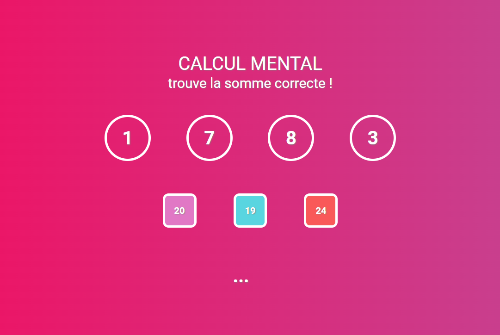

# 🖩 Web App - Calcul - Jeu d’additions interactif

Conception d'un jeu interactif en JavaScript pour pratiquer les additions de chiffres, renforçant les compétences en logique de programmation et en interaction utilisateur.

## 🌐 Technologies appliquées

- 

## 🛠️ Outils

- 

## 📷 Captures d’écran

## 🔗 Liens vers la démo

